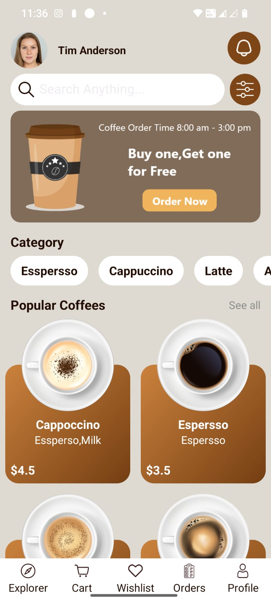
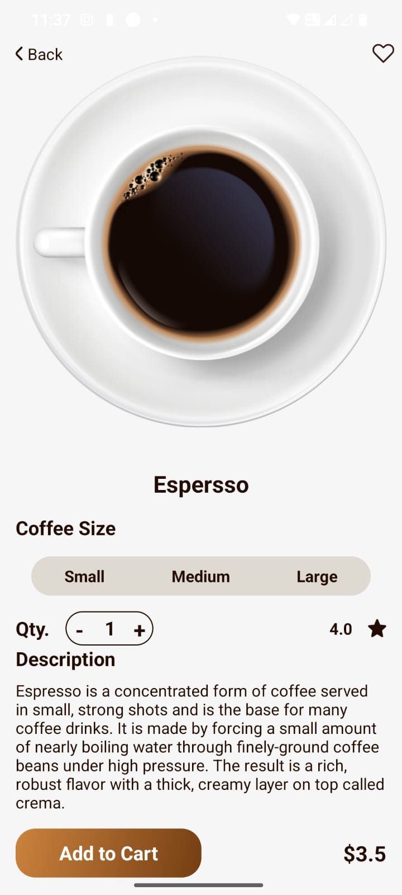
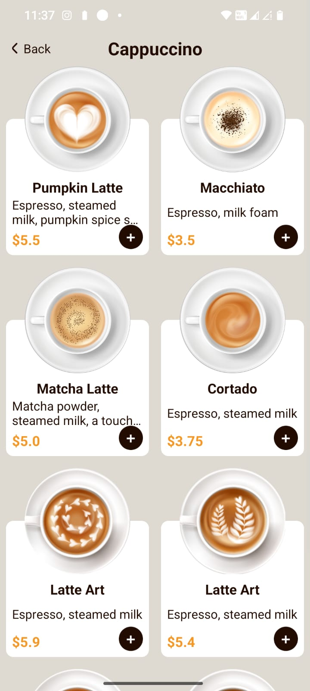
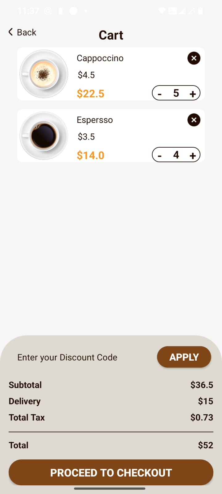

# 📦 Delivery App - Android

An elegant and functional food delivery Android application built using **Kotlin**, **XML (Jetpack Layouts)**, and **Android Jetpack components**. Users can browse food items, add them to cart, apply discount codes, and proceed to checkout.

---

## 🚀 Features

- 📷 Dynamic Image & Product Data (from **Firebase Realtime Database / Firestore** + **Firebase Storage**)
- 🛒 Add/Remove items from cart
- ➕ Increase or decrease item quantity
- 💸 Apply discount code input field
- 📦 View subtotal, tax, delivery fee, and total
- 🖼️ Product image loading using **Glide**
- 📦 Cart management using custom `TinyDB` helper (local storage)

---

## 🔥 Firebase Integration

This project uses **Firebase** for:

- **Realtime Product Data**: Item names, descriptions, prices, ratings.
- **Image Hosting**: Product pictures are fetched from **Firebase Storage**.
- You can easily extend it to support:
  - User Authentication
  - Order History
  - Realtime Cart Sync (Firestore)

---

## 🧰 Tech Stack

| Category       | Stack                        |
|----------------|------------------------------|
| Language       | Kotlin                       |
| Architecture   | MVVM                         |
| UI             | ConstraintLayout, RecyclerView |
| Image Loading  | Glide                        |
| Backend        | Firebase (Database + Storage)|
| Local Storage  | TinyDB (SharedPreferences)   |

---


## 🖼️ Screenshots

<table>
  <tr>
    <td align="center">
      <br/>
      <b>Home Screen</b>
    </td>
    <td align="center">
      <br/>
      <b>Product Details</b>
    </td>
  </tr>
  <tr>
    <td align="center">
      <br/>
      <b>Product List</b>
    </td>
    <td align="center">
      <br/>
      <b>Cart Page</b>
    </td>
  </tr>
</table>


## 📂 Project Structure
```
app/
├── manifests/
│ └── AndroidManifest.xml
├── java/
│ └── com.example.delivery_app/
│ ├── Activity/
│ │ ├── CartActivity.kt
│ │ ├── DetailActivity.kt
│ │ ├── ItemsListActivity.kt
│ │ ├── MainActivity.kt
│ │ └── SplashActivity.kt
│ ├── Adapter/
│ │ ├── CartAdapter.kt
│ │ ├── CategoryAdapter.kt
│ │ ├── ItemListCategoryAdapter.kt
│ │ └── PopularAdapter.kt
│ ├── Domain/
│ │ ├── BannerModel.kt
│ │ ├── CategoryModel.kt
│ │ └── ItemsModel.kt
│ ├── Helper/
│ │ ├── ChangeNumberItemsListener.kt
│ │ ├── ManagmentCart.kt
│ │ └── TinyDB.kt
│ ├── Repository/
│ │ └── MainRepository.kt
│ └── ViewModel/
│ └── MainViewModel.kt
├── res/
│ ├── drawable/
│ │ ├── Icons: back, bell_icon, close, star, plus, profile, search_icon, settings, splash_pic
│ │ ├── Backgrounds: brown_gradient_bg.xml, brown_storke_bg.xml, cream_bg.xml, white_bg.xml, etc.
│ ├── layout/
│ │ ├── activity_cart.xml
│ │ ├── activity_detail.xml
│ │ ├── activity_items_list.xml
│ │ ├── activity_main.xml
│ │ ├── activity_splash.xml
│ │ ├── viewholder_cart.xml
│ │ ├── viewholder_category.xml
│ │ ├── viewholder_item_list.xml
│ │ └── viewholder_popular.xml
│ ├── mipmap/
│ │ ├── ic_launcher/
│ │ └── ic_launcher_round/
│ ├── values/
│ │ ├── colors.xml
│ │ ├── strings.xml
│ │ └── themes.xml
│ └── xml/
│ ├── backup_rules.xml
│ └── data_extraction_rules.xml
```

## 🛠️ Tech Stack

- **Language:** Kotlin  
- **UI:** XML + ConstraintLayout + RecyclerView  
- **Image Loading:** Glide  
- **Storage:** TinyDB (SharedPreferences wrapper)  
- **Architecture:** MVVM-like with Helper & Adapter pattern

---

## 🧪 Setup & Run

1. Clone the repo:
   ```bash
   git clone https://github.com/your-username/DeliveryApp.git
2. Open in Android Studio

3. Let it sync Gradle files.

4. Run on emulator or connected device.

## 🧠 What's Next

- Complete the details in Explore, Wishlist, orders, and Profile
- 🔐 Firebase Authentication

---

## 🤝 Contributing
- PRs are welcome! If you have ideas for new features or improvements, feel free to fork the repo and submit a pull request.

## 📜 License
- This project is licensed under the MIT License - see the LICENSE file for details.

## 👨‍💻 Author
- C. Bhuvaneshvar Reddy

